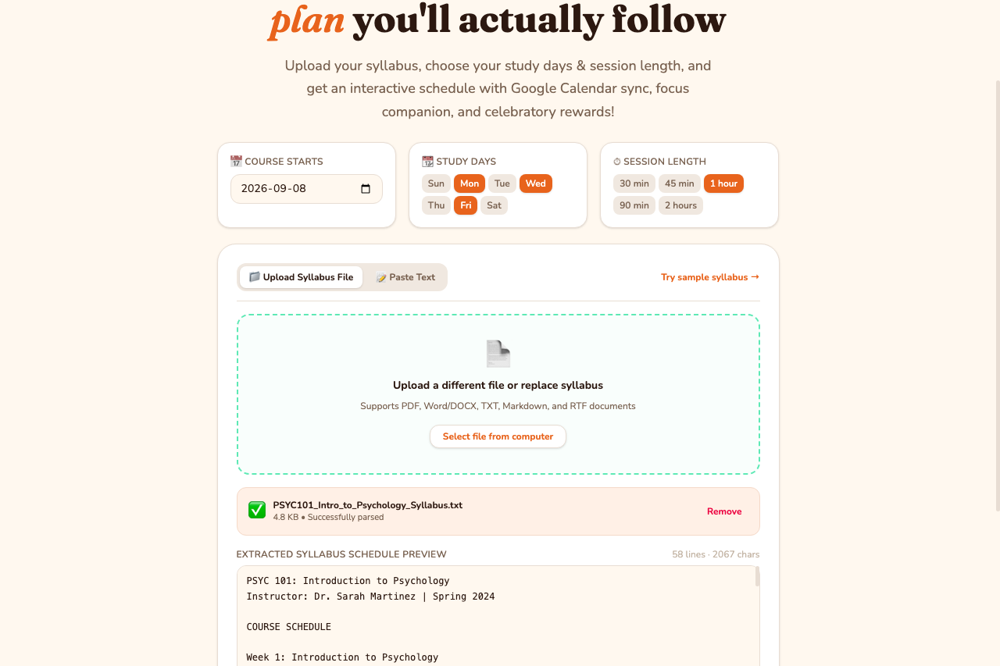
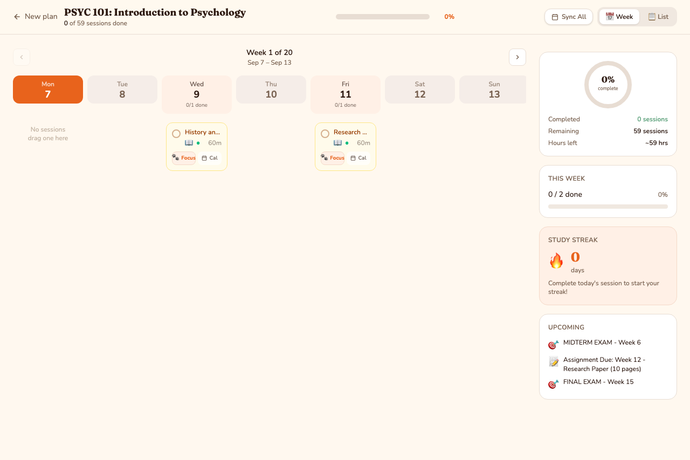
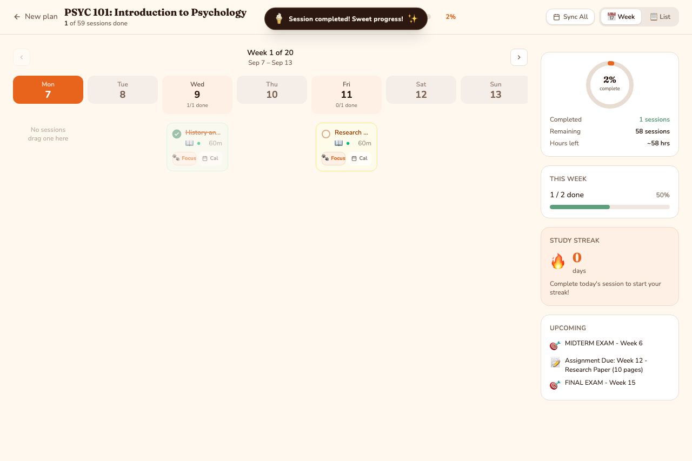
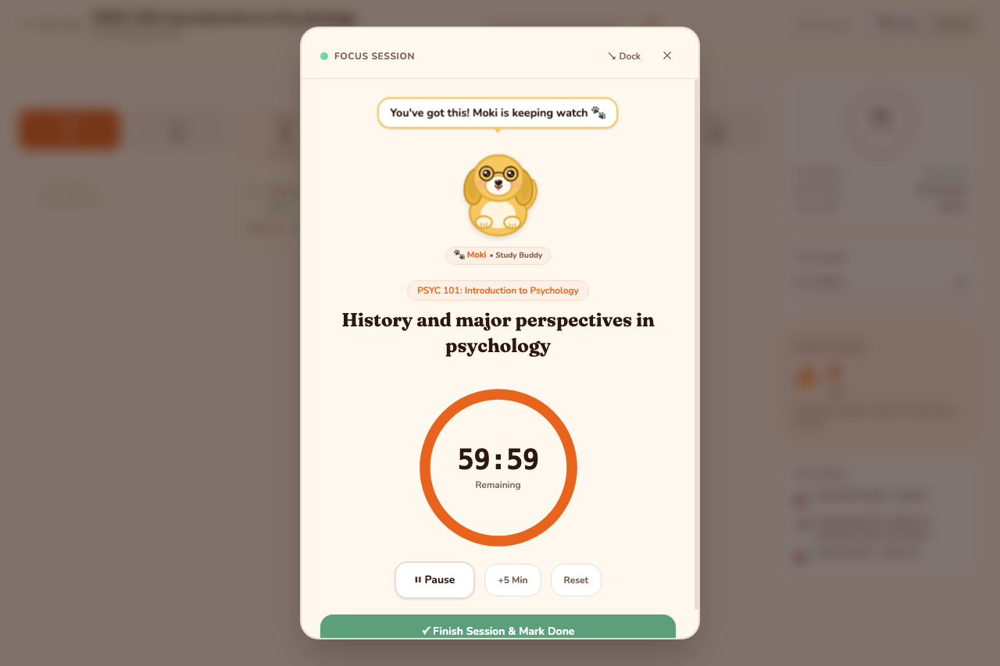
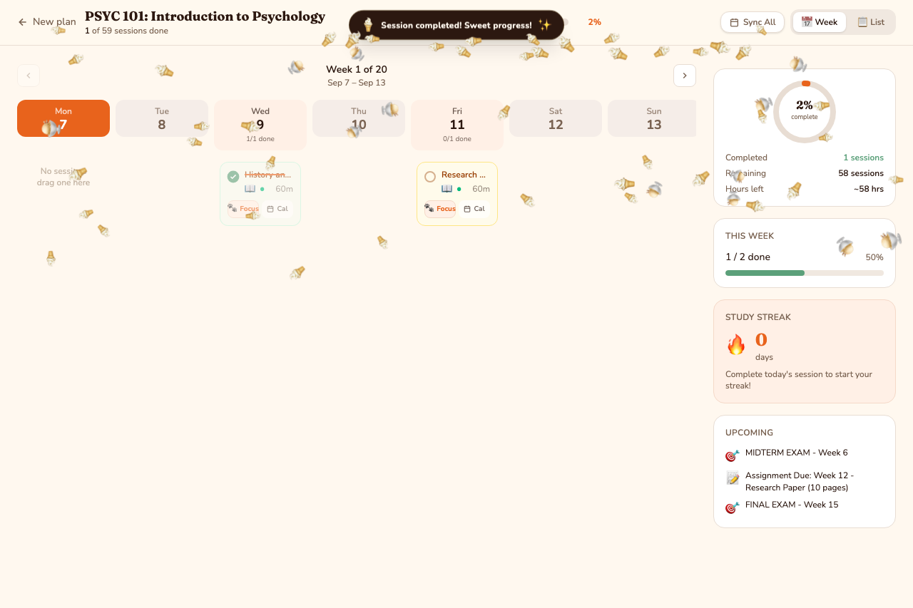

# Academic Study Planner

**Live Demo:** [Add link]\
**Product Design:** [https://www.figma.com/make/FfDBMgL5wzrqna4Rx02vf6/Academic-Study-Planner?t=l5WEFV03OqtU73lL-1\\](https://www.figma.com/make/FfDBMgL5wzrqna4Rx02vf6/Academic-Study-Planner?t=l5WEFV03OqtU73lL-1\\)\
**Built by:** Anh Tran

---

## The Problem

Students receive course syllabi containing deadlines, readings, assignments, exams, and weekly topics — but the syllabus itself doesn't tell them **how to organize their time**.

Students still have to answer:

- What should I study this week?
- How much time should I spend on each topic?
- When should I start preparing for an exam?
- How do I fit multiple courses into my schedule?

Most importantly, how should I plan out my WHOLE SEMESTER (because we love to plan ahead so that we feel in control)

So I've created the **Academic Study Planner**.

---

## The Solution

You just need to upload a syllabus, configure  study preferences, and receive a structured study plan.

### Core workflow

```text
Upload Syllabus
       ↓
Extract Course Schedule
       ↓
Configure Study Preferences
       ↓
Generate Study Plan
       ↓
Track Progress
       ↓
Focus & Complete Sessions
       ↓
Sync With Calendar
```

---

# Key Features

## 1. Syllabus Upload & Extraction

Students can upload PDF, TXT, DOCX, Markdown, RTF or copy plain text. The application extracts course topics and schedule information directly from the uploaded document and provides a preview before generating the study plan.

---

## 2. Personalized Study Planning

Students can configure:

- Course start date
- Available study days
- Session duration
- Weekly study schedule

The planner then generates study sessions around the student's preferences.

---

## 3. Study Plan Views

Students can view their schedule in:

- Weekly view
- List view

Each session includes:

- Study topic
- Subtopics
- Date
- Duration
- Completion status
- Calendar integration
- Focus mode

---

## 4. Progress Tracking

Students can mark sessions as complete and immediately see:

- Overall completion percentage
- Completed vs. total sessions
- Daily progress
- Weekly progress
- Visual progress indicators

Completed sessions receive a visual strikethrough treatment to provide immediate feedback.

---

## 5. Focus Mode

Each study session can be launched in Focus Mode.

Features include:

- Countdown timer
- Play / pause
- +5 minute extension
- Reset
- Finish & mark complete
- Picture-in-picture style dock

---

## 6. Moki

Moki (inspired by my first foster puppy) provides encouraging messages during focus sessions and celebrates when students complete a session. The goal is to make studying feel more engaging and rewarding without overwhelming the core productivity experience.

---

## 7. Calendar Integration

Students can add individual sessions to Google Calendar or sync the entire study plan. The full schedule can be exported as an `.ics` calendar file compatible with Google Calendar, Apple Calendar, and Outlook.

---

## Product Screens

### Syllabus Upload
Students upload their syllabus and preview the extracted course schedule before generating their plan.



* **Multi-format Support**: Upload PDF, DOCX, TXT, or Markdown documents with instant client-side schedule extraction.
* **Custom Scheduling**: Select start dates, study days (e.g. Mon / Wed / Fri), and session duration.
* **Live Schedule Preview**: Review extracted topics, assignments, and exams before generating the calendar.

---

### Study Plan
The generated schedule organizes course topics into manageable study sessions.



* **Interactive Week View**: Break down the entire term into structured, bite-sized weekly cards.
* **Smart Distribution**: Automatically spaces out syllabus material across study days while avoiding exam conflicts.
* **Direct Integration**: Export events directly to Google Calendar (`📅 Cal`) or launch focus mode (`🐾 Focus`).

---

### Account / Progress
Students can monitor completion across individual days and the overall course.



* **Completion Overview**: Real-time progress ring tracking total sessions, hours completed, and remaining workload.
* **Weekly Goals**: Monitor week-by-week progress bars to stay on track.
* **Study Streaks & Upcoming Deadlines**: Streak counters paired with reminders for upcoming quizzes and final exams.

---

### Focus Mode
Moki accompanies students during focused study sessions.



* **Moki Study Companion**: Animated companion puppy with dynamic mood states, blinking animations, and motivating study quotes.
* **Countdown Ring**: Full-screen and dockable picture-in-picture countdown timer with play/pause controls.
* **Distraction-Free**: Highlights a single active topic to promote deep focus.

---

### Confetti Celebration (Task Complete)
Confetti falls down when task complete.



* **Vanilla Ice Cream Confetti**: Sweet cones and cups (`🍦`) rain down across the screen whenever a study task is checked off.
* **Rewarding Feedback**: Toast celebration alert with instant progress increments to celebrate student achievements.


---

# Technical Architecture

```text
                Student
                   │
                   ↓
            React Frontend
                   │
        ┌──────────┴──────────┐
        ↓                     ↓
 Syllabus Upload         Study Preferences
        │                     │
        ↓                     ↓
 File Extraction        Plan Generator
        │                     │
        └──────────┬──────────┘
                   ↓
             Study Plan
                   │
        ┌──────────┼──────────┐
        ↓          ↓          ↓
   Progress     Focus      Calendar
   Tracking     Mode       Integration
```

---

# Technology Stack

| Layer           | Technology               |
| --------------- | ------------------------ |
| Frontend        | React                    |
| Language        | TypeScript               |
| Styling         | CSS / Tailwind           |
| File Processing | Client-side extraction   |
| Calendar        | Google Calendar / `.ics` |
| Animation       | CSS / SVG                |
| Audio           | Web Audio API            |
